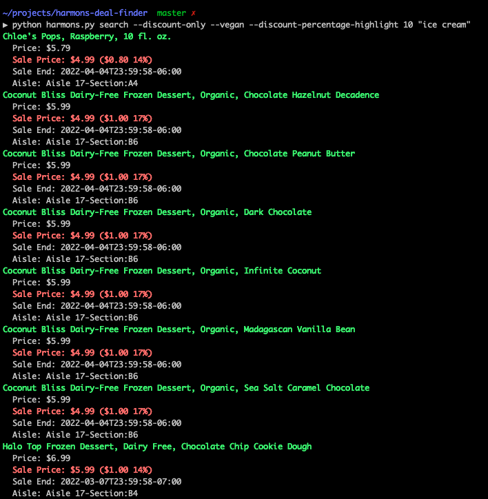

## Installation
1. You need to be using python version 3
2. Pull down the repository
3. Run `poetry install` to install required dependencies
4. Use the command line tool by seeing the examples below.

Note: If you don't have poetry, see [here](https://python-poetry.org/docs/#osx--linux--bashonwindows-install-instructions).

## Usage
```
python harmons.py search "ice cream"
```

```
python harmons.py search "ice cream" --discount-only
```

```
python harmons.py search "ice cream" --vegan
```

```
python harmons.py search "ice cream" --discount-only --vegan
```

```
python harmons.py search --discount-only --vegan --discount-percentage-highlight 10 "ice cream"
```

## Output
Example of output

